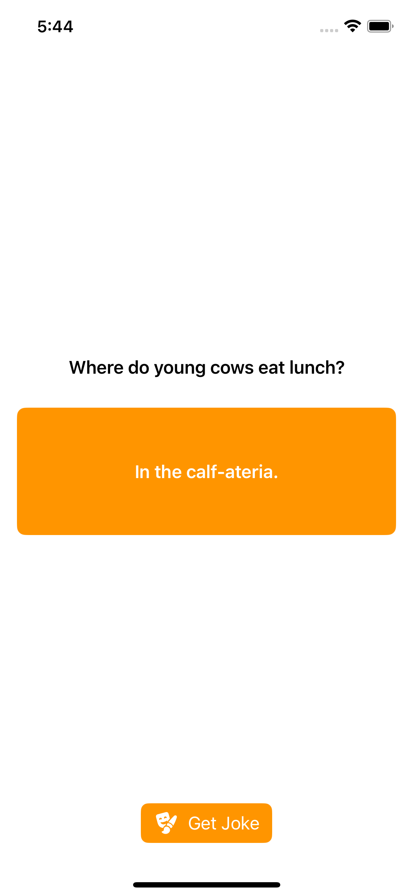
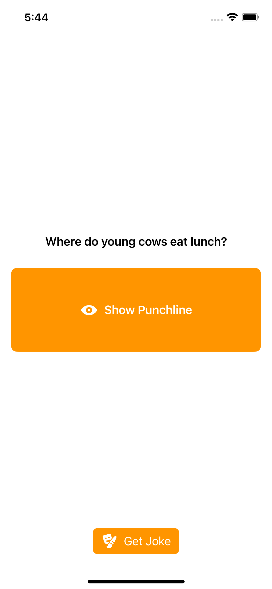

# SwiftUI API - Joke Generator

Joke Generator created as an example for Oasis SwiftUI workshop. Practice using an API endpoint and writing their first SwiftUI code.
(Slides)[https://docs.google.com/presentation/d/1GL0Vf8hYE24Ms-3nzphhltrOWt-OW_xFdDy6KU-p2iY/edit?usp=sharing]
 
## Screenshots
<table>
  <tr>
    <td></td>
    <td></td>
    <td></td>
  </tr>
 </table>
